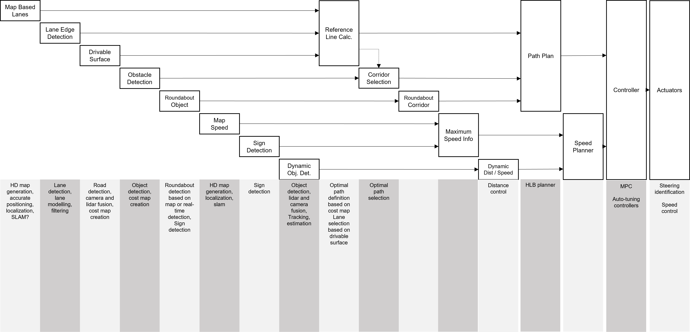
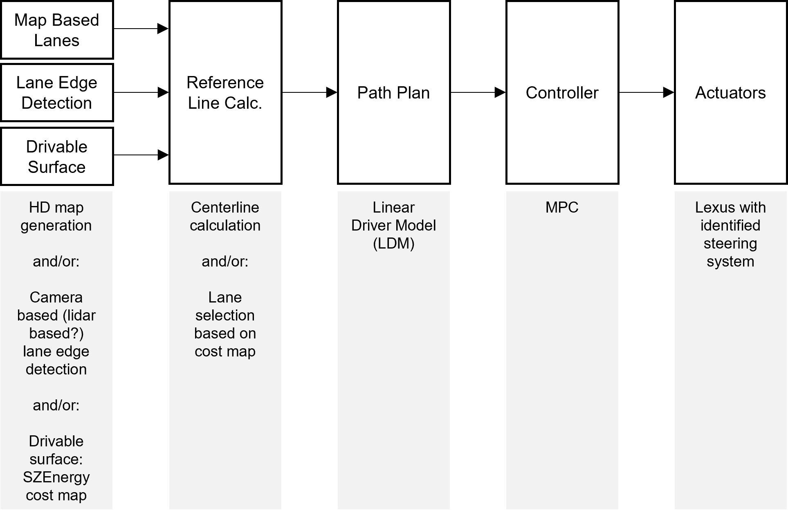

# Cruise Concept - an Automated Driving System by University of Gyor
The Cruise Concept (CC) is a research-driven product that covers the automated driving functions with the following purposes:
- following lanes on highway and rural roads,
- speed adjustments based on external rules and moving objects,
- handling of uncertain scenarios, especially roadworks and undefined lanes, 
- roundabout assist,

The following system generations are defined:
- CC-Gen1: Lane following by manual or constant (or independent) speed adjustments, rural and highways, between 30 and 130 kph
-- possible extensions / variations: lane information based on different sources, e.g., map, lane edge detection (camera) or drivable surface detection + lane selection
-- with the help of drivable surface detection, invisible lane marker situations can also be handled
- CC-Gen2: CC-Gen1 + static obstacle avoidance (e.g., road-works)
- CC-Gen3: CC-Gen2 + roundabouts
-- roundabout detection based on map information or by real-time detection (e.g., traffic signs)
-- creation of roundabout object incl. roundabout corridor
-- no stop and go in the first place
- CC-Gen4: CC-Gen3 + stop and go upon roundabout entry
-- stop and go brings the benefit of having a first solution for traffic jam assist (connection point with urban concept)
- CC-Gen5: automatic speed adjustment
-- **Note: previous generations may also include an initial speed planning, i.e, maximum speed **
-- speed adjustment can happen e.g., curve based, dynamic object based (distance control) and stop and go (stop behind vehicle)
-- dynamic object reaction is limited to object follow

The above purposes are implemented gradually, in the above listed order. These use cases are defined by industrial needs and other challenges.
Our goal is to emerge the requirements of two academic design competition into our research concept: Sheel ECO Marathon Urban Autonomous Challenge (Shell UAC) and Formula Student Driverless. \
Other concepts (e.g., urban concept) beside the Cruise Concept exist, and handled in a different research path.

Further, long term ideas (backlog):
- lane change accomplishment
- dynamic object prediction (e.g., object cut-in prediction, speed adjustment beforehand)

The Behavior Strategy Layer is currently not part of the above architecture but holds various research options:
- backward-looking functions (e.g., lane change decision based on vehicle coming from behind)
- strategy tests, decision on lane change, overtake... etc.

## Research fields (considering Gen5)

The above product includes various research potentials, which therefore mean fields for university researchers. The following summary figure includes many, but not exclusive list of fields, considering all components enlisted up to CC-Gen5. \
\

## CC-Gen1 Details
CC-Gen1 configuration of the cruise concept includes the human-like lane following on highway and rural roads. The following challenges must be tackled:
- lane information availability
-- simpliest solution: map based lane edges and center line calculation
-- lane edge detection: detection challenge
-- drivable surface cost map: cost map is available, selection of possible lanes is difficult
-- idea: fusion of above three?
- path planning: LDM improvements are necessary (path conditioning)
- controller: model-predictive control with higher lateral accuracy must be developed
- LDM may be replaced e.g., by GP based planner (same applies to controller) \
\

