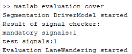

# Human-Like Behavior of Automated Driving Systems - Lane Wandering Model
The Drift-and-Compensate lane wandering model is an event-based model predictive control (MPC). The parameters of the MPC was defined by observing real drivers lane keeping characteristics.
The related publication can be found here [11] [Publications](../../../README.md). \
The analysis was carried out using the Human-like Behaviour for Automated Driving (HLB4AV) naturalistic driving dataset, published [13] [here](../../../README.md). \
The dataset raw data and the recording details can be found [here](https://jkk-research.github.io/dataset/jkk_dataset_03/). \
\
The complete package to reproduce the simulation results can be found in [this repository folder](https://github.com/gfigneczi1/hlb/tree/main/Solutions/CruiseConcept/laneWanderingModel) (please be noted, that 'dataIn' folder includes a copy of the relevant driving data, for exact reproduction of the results, **please use this data as inputs**).\
Please follow these steps:
## step 1: download 'laneWanderingSourceCode.zip' and unzip to a separate folder

The folder contains three subfolders:
- dataIn: previously mentioned input data for the scripts
- matlab_evaluation: all matlab scripts
- temp: a working folder to store the active input datasets and where the outputs are generated.
## step 2: open in MATLAB
Minimum requirement of the MATLAB version is not given, but the code was tested using MATLAB 2019b, hence this or newer version is advised. \
\
Then, add the matlab_evaluation/HLB folder (and its subfolders to the matlab path):\
 \
\
Step into the 'HLB' folder:\

## step 3: run the scripts
Without any modification in the downloaded data, 'Dr001_2022-03-08_62A_M7A.mat' file (which is originally stored in the temp folder) will be used to evaulate the scripts. If other drivers' data is wished to be analized, please copy it over from the 'dataIn' folder to the 'temp' folder. Multiple files can be evaulated at the same time.\
Then, type 'matlab_evaluation_cover' function in the matlab command window to start the scripts:\

### segmentation
First, the segmentor is called. This part of the scripts is responsible to load the data from the temp folder, run checks on data channel availability and condition the data, such as:
- adding new channels,
- transforming Long/Lat gps data to UTM coordinates,
- cut the data, if implausible segments are found, e.g., unreliable GPS data...etc.
  
The result of the segmentation is shown in the command window:\

### evaluation
After successful segmentation, the evaluation scripts are called, in order. \
First, the frequency definition script is called, which produces plots and related data in a .mat file in the temp/plots/frequencies subfolder. The progress is shown in the command window:\
\
In this case, 15 frequencies are tested, given the 1 measurement file.\
\
Then, the intervention points are calculated. The progress is shown again in the command window. As a result, in the temp/plots folder a figure is generated about the intervention point distribution, from file to file.\
\
As the last and third step within the evaulation, the MPC parameters are calculated and the snippets are simulated using the intervention points from the previous step and parameters defined in step. This is done in the 'functional_laneWanderingMpc' function. The longest part of the script when the optimization is run to fit the MPC parameters from snippet to snippet. In order to make things easier, the previously generated parameters are stored in the zip, in the dataIn subfolder. To run the script properly, this path must be replaced to the relevant folder after unzipping:\
\
In this script, there are two options to set:\
\
First is to use the previously stored optimized parameters (RESIMULATE_OPTIMIZED_PARAMETERS = true), or run the optimization once more (RESIMULATE_OPTIMIZED_PARAMETERS = false). Other option is to limit the number of snippets/file(driver), by setting MAXIMUM_NUMBER_OF_SNIPPETS to a certain value.
\
Finally, this function produces plot in the temp/snippets/ folder. Also, there is a mat file with simulation results of the given driver.
\
**Please be aware, the currently the script handles the positive/negative offset snippets together, by statically defining which one to use in the code:**\
\
If you want to use the scripts to evaluate the negative snippets instead, comment this line.