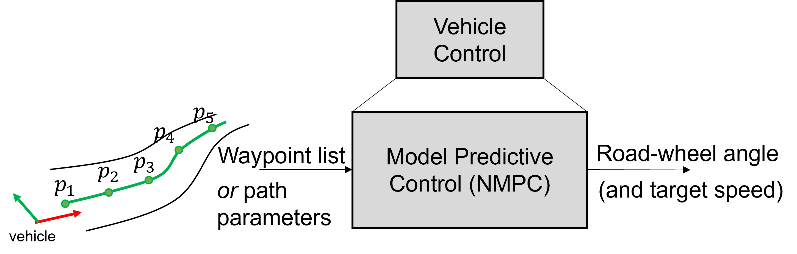
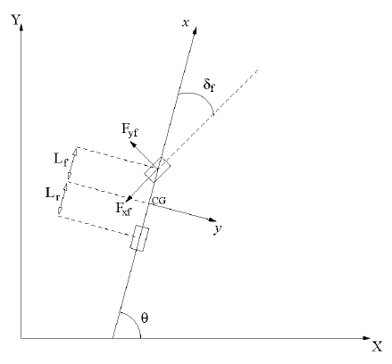

# Model Predictive Control at University of Gyor
This solution proposes a self-designed model predictive control (MPC) structure for path follow tasks of real vehicles.
The solution is developed and tested using a real vehicle.

# Problem Formulation
The MPC is requested to accomplish the following maneuvers:
- lane (path) following, where the path is planned by a superordinate component, which is not part of the MPC logic
- desired speed range: 20 kph to 130 kph, with occasional stop&go situation; note: stop&go can be handled by separate control logic
- lateral control (mainly), possible extension with longitudinal control logic
- maximum lateral acceleration of +/- $3.5 m/s^2$

Available infrastructure:
- MATLAB code (simple vehicle models, e.g., kinematic and dynamic bicycle models) together with linear MPC code [1]
- LGSVL simulation, where the four-wheel model of the test Lexus vehicle is available
- ROS framework, where path planning and actuator interfaces are available (ROS2)
- Gazebo simulation framework, where the model of simlpe robots are available + waypoint planner is available
\

\
The proposed simple architecture is shown on the above figure. The vehicle control includes the proposed MPC logic.
Low level control consists of two parallel components:
- steering angle control: delivered by the vehicle manufacturer, can be driven by CAN signals,
- speed control: developed by the university research team, which requests the target speed from the vehicle control then translates it acceleration and brake pedal signals (both normalized to range of 0-1). The control is a PID control for both braking and acceleration, including simple anti-windup logic (integrator switch of at saturation) and limitation on both acceleration and jerk for smooth drive-off and stopping. The PID parameters were tuned empirically considering dynamic and comfort requirements. However, the main application area of the developed MPC is lane following, hence speed control is less relevant. Goal is to set a constant maneuver speed and keep it with best accuracy during lane keeping. However, higher lateral acceleration may cause oscillation in the longitudinal speed, in which case the longitudinal control may need further revision.\
\
The univeristy research team uses Autoware Auto packages for various components of the above architecture. Hence, the first solution includes using the MPC proposed by Autoware. Link: https://autowarefoundation.github.io/autoware.universe/main/control/mpc_lateral_controller/
\
This controller is integrated and tuned to the Lexus vehicle, and may be used for reference of comparison in the future. However, our team's goal is to develop an own control logic which is used in various vehicles.

## Integration platforms
The developed algorithm is desired to be used on various platforms:
- Lexus test vehicle
- Formula Student Driverless vehicle (high speed handling)
- F1 1/10 model vehicle (high speed handling of RC vehicle)
- optional: Szenergy Urban Autonomous Challenge vehicles

All the above platforms shall use ROS2 framework.

## MPC interfaces
As mentioned above, path planner component provides the path to follow. This can happen in various representations:
- way point list (array of path points, with predefined even/uneven step sizes, usually given in the vehicle frame or a global frame, each point holds a pose (position+orientation)),
- path parameters (e.g., polynomial coefficients or other curve representations)
\
Additionally the target speed is provided by the speed planner. This may be directly transferred to the low level control or can be further adjusted by the vehicle control. Initially, it is desired to simply feed through the target velocity for simplification.

\
The output of the MPC shall be the road wheel angle (or steering angle), which is then delivered to the low level steering angle control. 

## Vehicle Model
Considering the speed and the lateral acceleration requirements, dynamic model is proposed to be used. The vehicle parameters are either available or to be measured. The following parameters may be necessary to properly define the model (list may be incomplete):
- track width and longitudinal axle distance,
- mass,
- steering angle / road wheel angle ratio or look up table,
- possible: dynamic model parameters of the steering system from steering angle to road wheel angle, modelled by a PT2 system -> parameters are planned to be identified in 2024/Q1,
- tire slip characteristics.

# Concepts, ideas
In the beginning phase the following considerations are proposed:
- dynamic vehicle model shall be used,
- vehicle parameters may not be available / may be inaccurate, therefore parameter estimation component may be needed,
- the vehicle model is non-linear, therefore NMPC shall be used,
- non-linear optimization toolbox is to be found, which provides sufficient runtime frequency AND accuracy,
- besides optimization functions the MPC functions may also be taken-over from a tool-box OR developed on our own,
- later, vehicle model may be extended by steering system dynamic model providing better accuracy (to be validated, compared),
- linear implementation, incl. constrained optimization functions is available on MATLAB level [1].

# Results
## Offline Models - MATLAB
The script is available [here](../../../_matlab_evaluation/HLB/04_standaloneScripts/nmpc_path_track.m).
The following vehicle model is used [V1]:
- $\dot{v}_y = \frac{F_{yf}}{m}cos\delta_f+\frac{F_{yr}}{m}-v_xr$
- $\dot{r} = \frac{L_f}{I_z}F_{yf}cos\delta_f-\frac{L_r}{I_z}F_{yr}$
- $\dot{x_g} = v_xcos\Theta-v_ysin\Theta$
- $\dot{y_g} = v_xsin\Theta+v_ycos\Theta$
- $\dot{\Theta} = r$
  
Where $r$ is the yawarate (unit: $rad/s$), $F_{yf}$ and $F_{yr}$ are the front and rear lateral tire forces (unit: $N$), $\delta_f$ is the road-wheel angle of the front wheel (unit: $rad$), $v_x$ and $v_y$ are longitudinal and lateral speed of the vehicle respectively (unit: $m/s$), $x_g$ and $y_g$ are the global coordinates of the CG (unit: $m$), $\Theta$ is the global orientation of the vehicle (unit: $rad$).
  
The free parameters of the vehicle model are the following:
- $m$ - vehicle mass, unit: $kg$
- $L_f$ and $L_r$ - distance between the center-of-gravity (cg) and the front/rear axle respectively, unit: $m$
- $I_z$ moment of interatio of the vehicle, unit: $kg m^2$

Also, constant longitudinal speed in the ego frame is assumed. \
\

The test script contains the following methods:\
Implementation of the model:
```
function dxdt = ODE(t, x, U)
```
Manual solver of one integration step:
```
function x_k = F(x_k1, U, Td)
```
Solver for given time (also incl. option of built-in ODE45 solver of MATLAB):
```
phi_tk = phi(t_N, U, x0)
```
Input signal interpolation:
```
function u_k = mu(U, t_k)
```
Output from state vector function:
```
function y = output(x)
```
Terminal and Running Cost:
```
function s = S(x,T)
function fl = l(x,u, t_k)
```
Optimization Object Function:
```
f = objfunx(U)
```
The following parameters must be given for the simulation:
- $N_p$ - number of prediction steps, unit: $-$, default value: $10$
- $T_h$ - prediction horizon, unit: $s$, default value: $6 s$
- $T_{solver}$ - solver step size, unit $s$, default value: $0.02 s$
- $T_s$ - simulation step size, unit $s$, default value: $0.1 s$
- $t_{steeringDelay}$ - considered steering delay, unit: $s$, default value: $0 s$
- $\alpha$ - the weight matrix, which contains the weights of the output signals in its diagonals, and zero everywhere else, default value: $ diag(10.0, 0.0)$
- $\kappa$ - weight of the input amplitude, default value: $0.001$
- $\beta$ - weight of the terminal cost, commonly given for all outputs, default value: $0.0$
- $v_x$ - vehicle speed is also given as a parameter of simulation, unit: $m/s$, default value: $30 m/s$
- $T$ - length of simulation, unit: $s$, default value: $40 s$

All parameters are given in the ```parameters``` struct.
The below results were generated using the default parameters. Optimization is done using the ```fminsearch``` function of MATLAB. The solver is ```ODE45``` of MATLAB.
The cost function is defined as the follows:\
$ \sum_{k=0}^{k=N_p}(\boldsymbol(y)-\boldsymbol(y_{ref}))^T\alpha(\boldsymbol(y)-\boldsymbol(y_{ref}))+\kappa u^2 + \beta (\boldsymbol(y)-\boldsymbol(y_{ref}))^T (\boldsymbol(y)-\boldsymbol(y_{ref}))$

# References
### Own publications
[1] Ignéczi G., Horvath E., Pup D.: Implementation of a self-developed model predictive control scheme for vehicle parking maneuvers. The first ISTRC Annual Conference, Tel-Aviv, Izrael, 21, June 2021. \
https://www.researchgate.net/publication/354774900_Implementation_of_a_self-developed_model_predictive_control_scheme_for_vehicle_parking_maneuvers

### Literature of control driver models (Cxx)
[C12]   Haobin Jiang, Huan Tian, and Yiding Hua. Model predictive driver model considering the steering characteristics of the skilled drivers. Advances in Mechanical Engineering, 11(3):1–14, 2019. \
[C13]   Alexander Katriniok, Jan P. Maschuw, et al. Optimal vehicle dynamics control for combined longitudinal and lateral autonomous vehicle guidance. In Proceedings of European Control Conference, pages 974–979, Z¨urich, Switzerland, 2013. \
[C14]   J. Kong, M. Pfeiffer, G. Schildbach and F. Borelli, "Kinematic and Dynamic Vehicle Models for Autonomous Driving Control Design," in IEEE Intelligent Vehicles Symposium, Seoul, Korea, 2015.\
[C15]   H. Ye, H. Jiang, S. Ma, B. Tang and L. Wahab, "Linear model predictive control of automatic parking path tracking with soft constraints," International Journal of Advanced Robotic Systems, pp. 1 - 13, May - June 2019. \
[C16]   O. Pauca, C. F. Curuntu and C. Lazar, "Predictive Control for the lateral and longitudinal dynamics in automated vehicles," in 23rd International Conference on System Theory, Control and Computing, Sinaia, 2019. \
[C17]   L. Wang, Model Predictive Control System Design and Implementation using Matlab, London: Springer - Verlag, 2009, pp. 28 - 84, 324 - 359.\
[C18]   Findeisen, Rolf & Allgöwer, Frank. (2002). An introduction to nonlinear model predictive control. 21st Benelux Meeting on Systems and Control. 

### Literature of Vehicle modelling (Vxx)
[V1]    Romain Pepy, Alain Lambert and Hugues Mounier: Path Planning using a Dynamic Vehicle Model, Institut d'Electronique Fondamentale UMR CNRS 8622 - Universite Paris-Sud XI Bat. 220, 914U05 Orsay, France

### Proposed toolboxes
- https://tinympc.org
- https://gekko.readthedocs.io
- https://docs.acados.org/about_acados/index.html#:~:text=acados%20is%20a%20software%20package,Moritz%20Diehl.
- https://forces.embotech.com/Documentation/_static/FORCESPRO.pdf (for professional application, later phase) 
- https://www.do-mpc.com/en/latest/

### Connecting Repositories
- Path planner using Linear Driver Model (LDM) [6] developed in ROS (obsolete) and ROS2 (maintained)\
  https://github.com/jkk-research/laneKeepSystem
- Szenergy team resources, incl. possible use case of the MPC\
  https://github.com/szenergy/autonomous_master_repo (private)
- Lexus bring up\
  https://github.com/jkk-research/lexus_bringup 