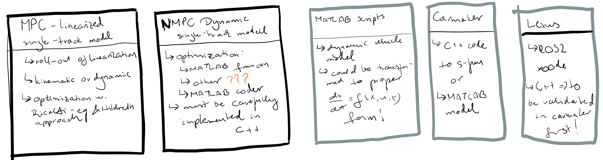

# Vehicle Controllers
This folder contains the source code of multiple trajectory tracking algorithms.

## Model Predictive Control

### Architectures

### Validation Steps

1) Implement code in MATLAB script level using the dynamic single track model + steering dynamic model
2) Validated MATLAB script level the concepts (various optimization approaches)

3) Take over code to either Simulink (using parts of the MATLAB code) or directly to C++
4) Validate using CARMAKER vehicle model -> road of Zala highway to be done + synthetic road section e.g., S-curve

5) Using C++ code build ROS2 node(s) for the components
6) Validate and calibrate the controller in real vehicle

### Test cases

1) Lane follow use case: speed range of 50 - 130 kph
2) Traffic jam assist: speed range of 10 - 50 kph
3) Stop & Go situations: specific short term conditions of velocity close to zero
4) Urban use cases: stop&go + low speed up until 50 kph

First test cases for all use cases shall cover straight road driving, no intial offset and straight road driving, with initial position and/or orientation offset.
Then, curving, with high radius curve, especially examining curve entry and exit parts. Lateral acceleration shall not be higher than 3.5 m/s^2.

